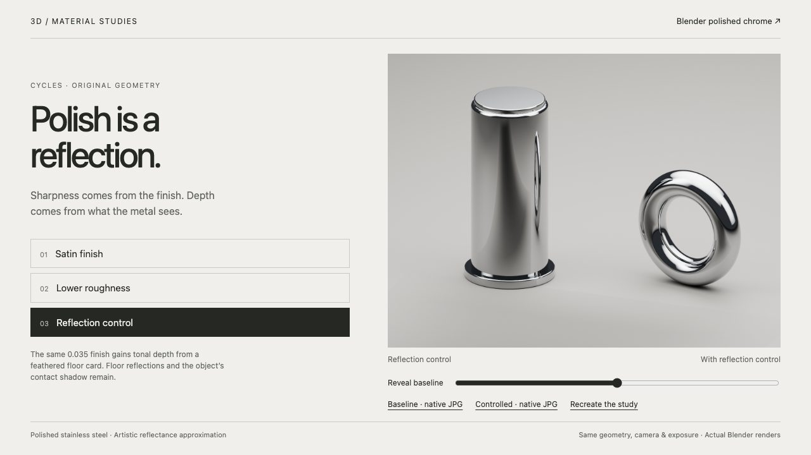
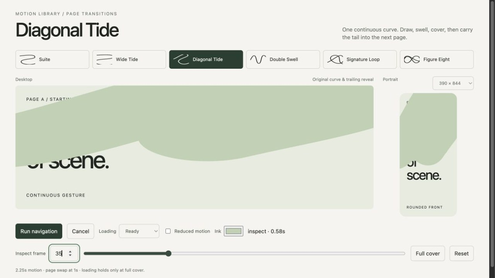
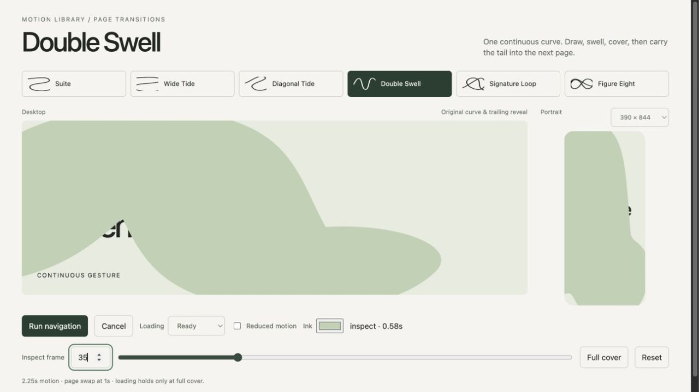
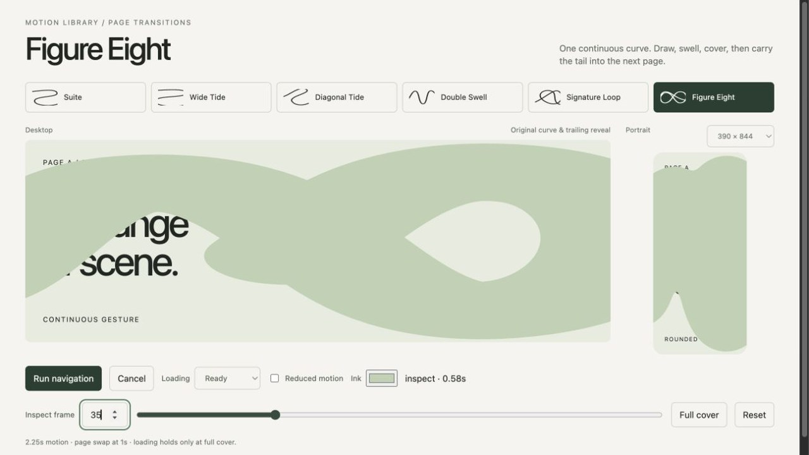
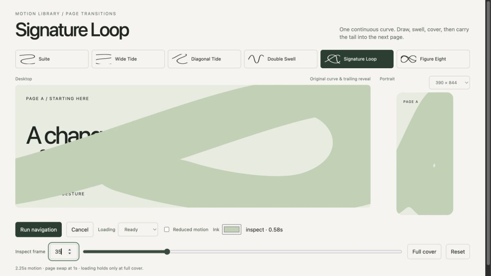
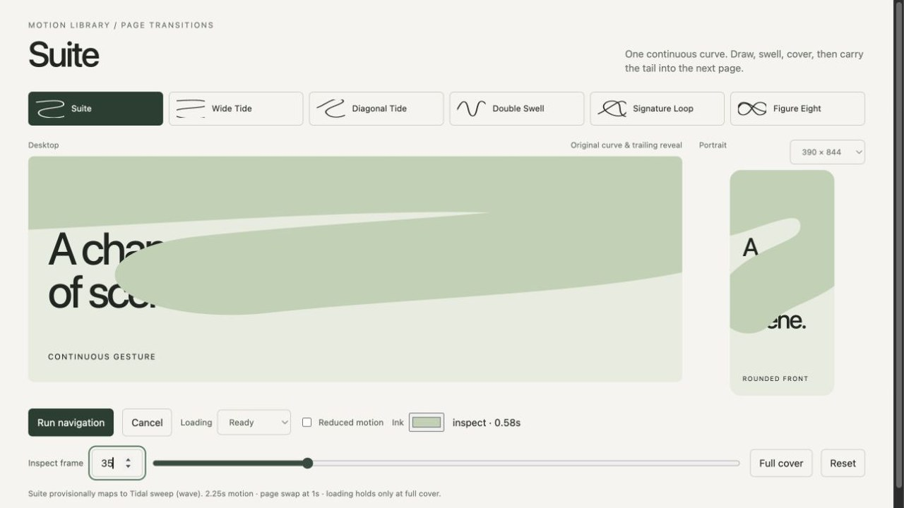
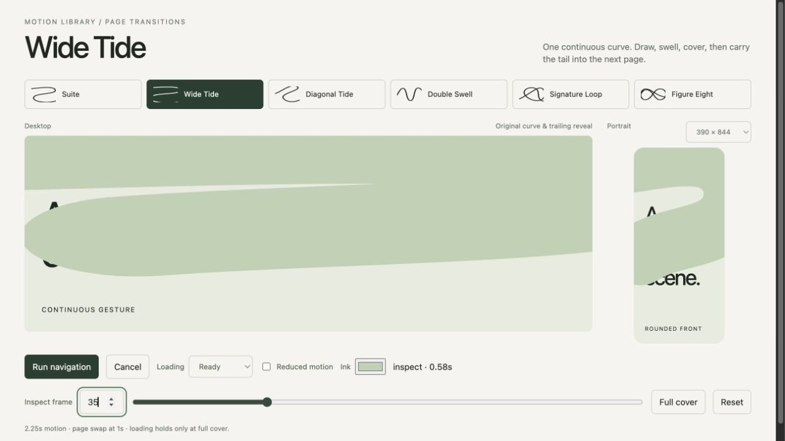
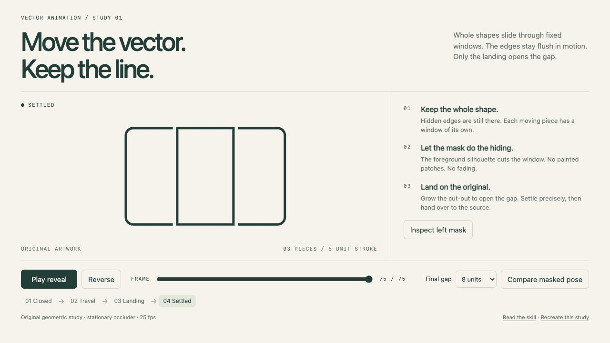

# Demo Screenshot Gallery

Every demo, rendered in a real browser at 1280 x 720. See [DEMOS.md](DEMOS.md) for how to run and rebuild them, or open the [visual gallery](SCREENSHOTS.html) locally.

- Captured demos: 17
- Format: JPEG

## 3d/materials (1)

### blender-polished-chrome

Create realistic chrome and mirror-polished metal renders in Blender Cycles. Use for polished stainless steel, chrome plating, satin-looking metal, harsh reflection bands, and studio material or lighting refinement while preserving product geometry.

[Open demo](skills/3d/materials/blender-polished-chrome/demo/index.html) · [Skill](skills/3d/materials/blender-polished-chrome/SKILL.md) · [Prompt](skills/3d/materials/blender-polished-chrome/demo/PROMPT.md)

## ui/page-transitions (6)

### gsap-transition-diagonal-tide

Build the Diagonal Tide hand-drawn GSAP page transition. A broad S sweeps across the page on a slant. Use when the user asks for Diagonal Tide, the diagonal-tide transition, or this named draw-swell-cover-reveal effect on a website. Ships reusable curves, adaptive portrait fronts, a covered routing lifecycle and a working demo.

[Open demo](skills/ui/page-transitions/gsap-transition-diagonal-tide/demo/index.html) · [Skill](skills/ui/page-transitions/gsap-transition-diagonal-tide/SKILL.md) · [Prompt](skills/ui/page-transitions/gsap-transition-diagonal-tide/demo/PROMPT.md)

### gsap-transition-double-swell

Build the Double Swell hand-drawn GSAP page transition. Two rounded waves rise and fall across the screen. Use when the user asks for Double Swell, the double-swell transition, or this named draw-swell-cover-reveal effect on a website. Ships reusable curves, adaptive portrait fronts, a covered routing lifecycle and a working demo.

[Open demo](skills/ui/page-transitions/gsap-transition-double-swell/demo/index.html) · [Skill](skills/ui/page-transitions/gsap-transition-double-swell/SKILL.md) · [Prompt](skills/ui/page-transitions/gsap-transition-double-swell/demo/PROMPT.md)

### gsap-transition-figure-eight

Build the Figure Eight hand-drawn GSAP page transition. Two loose loops cross and open across the frame. Use when the user asks for Figure Eight, the figure-eight transition, or this named draw-swell-cover-reveal effect on a website. Ships reusable curves, adaptive portrait fronts, a covered routing lifecycle and a working demo.

[Open demo](skills/ui/page-transitions/gsap-transition-figure-eight/demo/index.html) · [Skill](skills/ui/page-transitions/gsap-transition-figure-eight/SKILL.md) · [Prompt](skills/ui/page-transitions/gsap-transition-figure-eight/demo/PROMPT.md)

### gsap-transition-signature-loop

Build the Signature Loop hand-drawn GSAP page transition. A tilted loop with a long, handwritten flourish. Use when the user asks for Signature Loop, the signature transition, or this named draw-swell-cover-reveal effect on a website. Ships reusable curves, adaptive portrait fronts, a covered routing lifecycle and a working demo.

[Open demo](skills/ui/page-transitions/gsap-transition-signature-loop/demo/index.html) · [Skill](skills/ui/page-transitions/gsap-transition-signature-loop/SKILL.md) · [Prompt](skills/ui/page-transitions/gsap-transition-signature-loop/demo/PROMPT.md)

### gsap-transition-suite

Build the Suite hand-drawn GSAP page transition. One broad S-curve rolls from top to bottom. Use when the user asks for Suite, the wave transition, or this named draw-swell-cover-reveal effect on a website. Ships reusable curves, adaptive portrait fronts, a covered routing lifecycle and a working demo.

[Open demo](skills/ui/page-transitions/gsap-transition-suite/demo/index.html) · [Skill](skills/ui/page-transitions/gsap-transition-suite/SKILL.md) · [Prompt](skills/ui/page-transitions/gsap-transition-suite/demo/PROMPT.md)

### gsap-transition-wide-tide

Build the Wide Tide hand-drawn GSAP page transition. Long horizontal sweeps with turns beyond the frame. Use when the user asks for Wide Tide, the wide-tide transition, or this named draw-swell-cover-reveal effect on a website. Ships reusable curves, adaptive portrait fronts, a covered routing lifecycle and a working demo.

[Open demo](skills/ui/page-transitions/gsap-transition-wide-tide/demo/index.html) · [Skill](skills/ui/page-transitions/gsap-transition-wide-tide/SKILL.md) · [Prompt](skills/ui/page-transitions/gsap-transition-wide-tide/demo/PROMPT.md)

## ui/sections (9)

### gooey-section-drift

Rebuilds the 'Drift' gooey section edge from Louis's motion labs (gooey-sections.html, tab 7): the crest surfs sideways along the edge in the direction you scroll. The boundary between two page sections acts like a liquid surface driven by scroll speed. Use this skill whenever the user asks for the drift goo or drift edge, or wants a section edge whose bulge travels or surfs sideways as you scroll, or for gooey sections tab 7, on a plain HTML page, a Webflow site or a React/Next.js app, even if they only name the feel. It ships a verified 1:1 port of the lab engine, so the result matches the lab exactly.

[Open demo](skills/ui/sections/gooey-section-drift/demo/index.html) · [Skill](skills/ui/sections/gooey-section-drift/SKILL.md) · [Prompt](skills/ui/sections/gooey-section-drift/demo/PROMPT.md)

### gooey-section-elastic

Rebuilds the 'Elastic' gooey section edge from Louis's motion labs (gooey-sections.html, tab 5): twangy: it overshoots whatever the scroll asks for and springs back past flat before settling. The boundary between two page sections acts like a liquid surface driven by scroll speed. Use this skill whenever the user asks for the elastic goo or elastic edge, or wants a bouncy, springy, twangy or rubber-band section edge, or for gooey sections tab 5, on a plain HTML page, a Webflow site or a React/Next.js app, even if they only name the feel. It ships a verified 1:1 port of the lab engine, so the result matches the lab exactly.

[Open demo](skills/ui/sections/gooey-section-elastic/demo/index.html) · [Skill](skills/ui/sections/gooey-section-elastic/SKILL.md) · [Prompt](skills/ui/sections/gooey-section-elastic/demo/PROMPT.md)

### gooey-section-goo

Rebuilds the 'Goo' gooey section edge from Louis's motion labs (gooey-sections.html, tab 2): a tight, sticky pull whose flanks sink slightly before rejoining the flat line. The boundary between two page sections acts like a liquid surface driven by scroll speed. Use this skill whenever the user asks for the goo edge, 'the goo one' or the sticky goo, or for gooey sections tab 2, on a plain HTML page, a Webflow site or a React/Next.js app, even if they only name the feel. This is the default feel: also use it when someone asks for a gooey, goo, liquid, blobby or melting section edge, divider or transition without naming a variant. It ships a verified 1:1 port of the lab engine, so the result matches the lab exactly.

[Open demo](skills/ui/sections/gooey-section-goo/demo/index.html) · [Skill](skills/ui/sections/gooey-section-goo/SKILL.md) · [Prompt](skills/ui/sections/gooey-section-goo/demo/PROMPT.md)

### gooey-section-honey

Rebuilds the 'Honey' gooey section edge from Louis's motion labs (gooey-sections.html, tab 4): a heavy, full blob that is slow to rise and droops back very slowly. The boundary between two page sections acts like a liquid surface driven by scroll speed. Use this skill whenever the user asks for the honey goo or honey edge, or wants a heavy, slow, syrupy or droopy section edge, or for gooey sections tab 4, on a plain HTML page, a Webflow site or a React/Next.js app, even if they only name the feel. It ships a verified 1:1 port of the lab engine, so the result matches the lab exactly.

[Open demo](skills/ui/sections/gooey-section-honey/demo/index.html) · [Skill](skills/ui/sections/gooey-section-honey/SKILL.md) · [Prompt](skills/ui/sections/gooey-section-honey/demo/PROMPT.md)

### gooey-section-peel

Rebuilds the 'Peel' gooey section edge from Louis's motion labs (gooey-sections.html, tab 9): it drains fast from full stretch, then the last of it peels off slowly. The boundary between two page sections acts like a liquid surface driven by scroll speed. Use this skill whenever the user asks for the peel goo or peel edge, or wants a section edge that lets go fast then lingers with a slow tail, or for gooey sections tab 9, on a plain HTML page, a Webflow site or a React/Next.js app, even if they only name the feel. It ships a verified 1:1 port of the lab engine, so the result matches the lab exactly.

[Open demo](skills/ui/sections/gooey-section-peel/demo/index.html) · [Skill](skills/ui/sections/gooey-section-peel/SKILL.md) · [Prompt](skills/ui/sections/gooey-section-peel/demo/PROMPT.md)

### gooey-section-slosh

Rebuilds the 'Slosh' gooey section edge from Louis's motion labs (gooey-sections.html, tab 8): a liquid lean: the edge rises on one side of the cursor and dips on the other, like water tilting. The boundary between two page sections acts like a liquid surface driven by scroll speed. Use this skill whenever the user asks for the slosh goo or slosh edge, or wants a section edge that tilts, leans or sloshes like liquid, or for gooey sections tab 8, on a plain HTML page, a Webflow site or a React/Next.js app, even if they only name the feel. It ships a verified 1:1 port of the lab engine, so the result matches the lab exactly.

[Open demo](skills/ui/sections/gooey-section-slosh/demo/index.html) · [Skill](skills/ui/sections/gooey-section-slosh/SKILL.md) · [Prompt](skills/ui/sections/gooey-section-slosh/demo/PROMPT.md)

### gooey-section-taffy

Rebuilds the 'Taffy' gooey section edge from Louis's motion labs (gooey-sections.html, tab 3): it stretches smoothly while you scroll; let go and it drops, overshoots past flat, comes back and gives one small wobble. The boundary between two page sections acts like a liquid surface driven by scroll speed. Use this skill whenever the user asks for the taffy goo or taffy edge, or wants a scroll-driven section edge that stretches and then snaps back with a single wobble, or for gooey sections tab 3, on a plain HTML page, a Webflow site or a React/Next.js app, even if they only name the feel. It ships a verified 1:1 port of the lab engine, so the result matches the lab exactly.

[Open demo](skills/ui/sections/gooey-section-taffy/demo/index.html) · [Skill](skills/ui/sections/gooey-section-taffy/SKILL.md) · [Prompt](skills/ui/sections/gooey-section-taffy/demo/PROMPT.md)

### gooey-section-twin

Rebuilds the 'Twin' gooey section edge from Louis's motion labs (gooey-sections.html, tab 6): the main pull with a smaller sympathetic blob rising beside it. The boundary between two page sections acts like a liquid surface driven by scroll speed. Use this skill whenever the user asks for the twin goo or twin edge, or wants a section edge with two blobs or a double bulge, or for gooey sections tab 6, on a plain HTML page, a Webflow site or a React/Next.js app, even if they only name the feel. It ships a verified 1:1 port of the lab engine, so the result matches the lab exactly.

[Open demo](skills/ui/sections/gooey-section-twin/demo/index.html) · [Skill](skills/ui/sections/gooey-section-twin/SKILL.md) · [Prompt](skills/ui/sections/gooey-section-twin/demo/PROMPT.md)

### gooey-section-wave

Rebuilds the 'Wave' gooey section edge from Louis's motion labs (gooey-sections.html, tab 1): a broad, flowing crest with a soft shoulder trailing to its right. The boundary between two page sections acts like a liquid surface driven by scroll speed. Use this skill whenever the user asks for the wave goo, the wave edge, the wave section divider, 'the wave one' or Louis's favourite goo, or for gooey sections tab 1, on a plain HTML page, a Webflow site or a React/Next.js app, even if they only name the feel. It ships a verified 1:1 port of the lab engine, so the result matches the lab exactly.

[Open demo](skills/ui/sections/gooey-section-wave/demo/index.html) · [Skill](skills/ui/sections/gooey-section-wave/SKILL.md) · [Prompt](skills/ui/sections/gooey-section-wave/demo/PROMPT.md)

## ui/vector-animation (1)

### vector-mask-reveal

Animate overlapping pieces of outlined vector logos and illustrations with per-piece masks, constant strokes, flush travel and gaps that open only on landing. Use for petals, letters or bars moving apart or assembling when hidden edges, joins and the final artwork must remain exact.

[Open demo](skills/ui/vector-animation/vector-mask-reveal/demo/index.html) · [Skill](skills/ui/vector-animation/vector-mask-reveal/SKILL.md) · [Prompt](skills/ui/vector-animation/vector-mask-reveal/demo/PROMPT.md)

